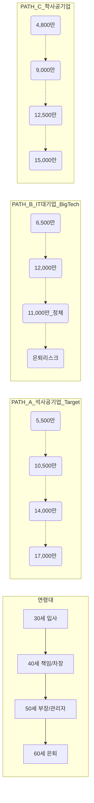

# 📊 [v4] 생애 주기별 소득 로드맵 및 대조군 분석 (시각화)

**대상:** 1997년생 경북대 컴퓨터공학 석사 졸업생  
**핵심 질문:** 석사 학위가 타 직종 대비 어떤 경제적 우위를 갖는가?

---

## 📈 1. 생애 연봉 추이 그래프 (Visual Curve)

아래 그래프는 정년(만 60세)까지의 예상 연봉 변화를 나타냅니다.



### **그래프 해석:**
1.  **석사 공기업 (Path A):** 초봉은 대기업보다 낮으나, **호봉 인정 및 정년 보장**으로 인해 50대 이후 생애 소득이 역전됨.
2.  **IT 대기업 (Path B):** 초반 폭발적 연봉(네카라쿠배 기준 6.5~7.5천)이 매력적이나, 40대 후반 이후 실무직 탈락 및 조기 퇴직 리스크 존재.
3.  **학사 공기업 (Path C):** 석사 대비 시작 호봉이 낮아(약 500~700만 원 차이) 전 기간 소득이 석사보다 하향 곡선 형성.

---

## 💰 2. 31년 생애 총소득(LTI) 시각 비교 (만 30~60세)

```text
[생애 총소득 예상 바 그래프 (만원 단위)]

Path A (석사 공기업)  : [██████████████████████████████████] 345,000  (34.5억)
Path B (IT 대기업)    : [██████████████████████████████      ] 290,000  (29.0억) ※ 조기은퇴 가정시
Path C (학사 공기업)  : [████████████████████████████████    ] 315,000  (31.5억)
Path D (9급 공무원)   : [██████████████████                  ] 180,000  (18.0억)
```
*   **분석:** 석사 학위(Path A)가 학사(Path C)보다 생애 소득에서 **약 3억 원 이상** 앞서며, 조기 은퇴 리스크가 큰 대기업(Path B)보다 훨씬 안정적인 자산 형성이 가능함.

---

## 🏆 3. 커리어 대조군 상세 분석표

| 구분 | **[Path A] 석사 공기업** | [Path B] IT 대기업 | [Path C] 학사 공기업 | [Path D] 9급 공무원 |
| :--- | :---: | :---: | :---: | :---: |
| **시작 나이** | 30세 (석사후) | 27~30세 | 27~28세 | 25~30세 |
| **초봉(2027)** | 5,500~6,000 | 6,500~7,500 | 4,800~5,200 | 3,300~3,500 |
| **정점 연봉** | 1.6억 ~ 1.8억 | 1.5억+ (변동) | 1.4억 ~ 1.5억 | 1.0억 ~ 1.1억 |
| **안정성** | 최상 (정년보장) | 보통 (이직필수) | 최상 (정년보장) | 극상 |
| **석사 우대** | **호봉2년 인정+가점** | 실력 위주(가점 미미) | 없음 | 없음 |
| **종합 평점** | ★★★★★ (S등급) | ★★★★☆ (A등급) | ★★★★☆ (A등급) | ★★★☆☆ (B등급) |

---

## 📜 4. 최종 전략 요약 (1997년생 기준)

1.  **30억 원 이상의 생애 소득**을 달성하기 위한 가장 확실한 길은 **'경북대 지역인재 할당제'**를 활용한 대구·경북권 공기업 IT/연구직군 입사입니다.
2.  **석사 네임벨류**를 활용하여 금융권(산은, 기은) 입사 시 위 그래프의 Path A보다 상단 곡선(최고 40억) 형성이 가능합니다.
3.  지금 바로 **어학 성적**과 **정보처리기사**를 확보하지 않으면, 위 그래프의 가장 낮은 Path D(또는 무직) 상태로 머무를 위험이 있습니다.

---
[INDEX로 돌아가기](INDEX.md)
